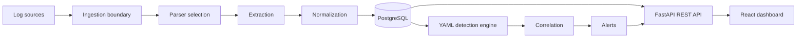

# Architecture

SentinelLite 0.1 is a modular monolith: one FastAPI process owns ingestion, normalization, detections, correlation, and REST APIs; PostgreSQL is the durable store; and a separately built React application provides the analyst experience. This keeps local operations understandable while preserving clean seams for future collectors or workers.

## Ingestion and parser selection

The API accepts single objects/lines, batches, multiline text, and bounded UTF-8 uploads. Upload handling strips path components, permits only documented text extensions, rejects NUL-containing input, enforces byte/event limits, and never executes content. JSON arrays, JSON Lines, CSV, TSV, and line-oriented files become individual records.

`ParserEngine` applies a deterministic layered strategy: structured JSON detection; a confidence-ranked specialized parser; key-value extraction; delimited extraction; heuristic extraction; then raw fallback. Parsers expose `confidence` and `parse`; they do not write the database. Specialized parsers currently cover Linux SSH/auth, common HTTP access logs, syslog, flat Windows/Sysmon-style JSON, and firewall records.

## Normalization and storage

Normalization maps aliases into nullable canonical fields, validates IPv4/IPv6 and ports, converts recognized timestamps to UTC, retains unrecognized values as metadata, and removes NULs/limits scalar length. It never invents `event_timestamp`; `ingested_at` is separate. Every row stores the exact bounded `raw_event`, parser identity, confidence, and status.

SQLAlchemy models provide Events, Alerts, and their many-to-many evidence relationship. Alembic owns schema evolution. Investigation fields have focused indexes; list queries are paginated.

## Detection and correlation

Validated YAML rules are loaded at process startup. The engine supports equality, membership, case-insensitive contains/regex, `all`/`any`, single-event matches, grouped thresholds, distinct-field thresholds, and ordered two-or-more-stage sequences. Active alerts for the same rule/group are updated instead of duplicated. A small correlation service raises `CORR-001` when repeated authentication failures, a success, and suspicious PowerShell execution occur for the same host/identity.

## API and frontend

FastAPI provides OpenAPI plus health, ingestion, event, alert, rule, statistics, and host routes below `/api/v1`. React Router powers seven responsive views: overview, events, event detail, alerts, alert detail, rules, and hosts. The UI renders all log/evidence values as React text, never trusted HTML.

## Future scalability

The modular monolith is appropriate for local and small-team workloads. A future release can move ingestion/detection into bounded background jobs, partition events by time, introduce collector authentication, add retention controls, and stream updates without changing the normalized event contract. Kafka, clustering, and Elasticsearch are intentionally absent from V0.1.
